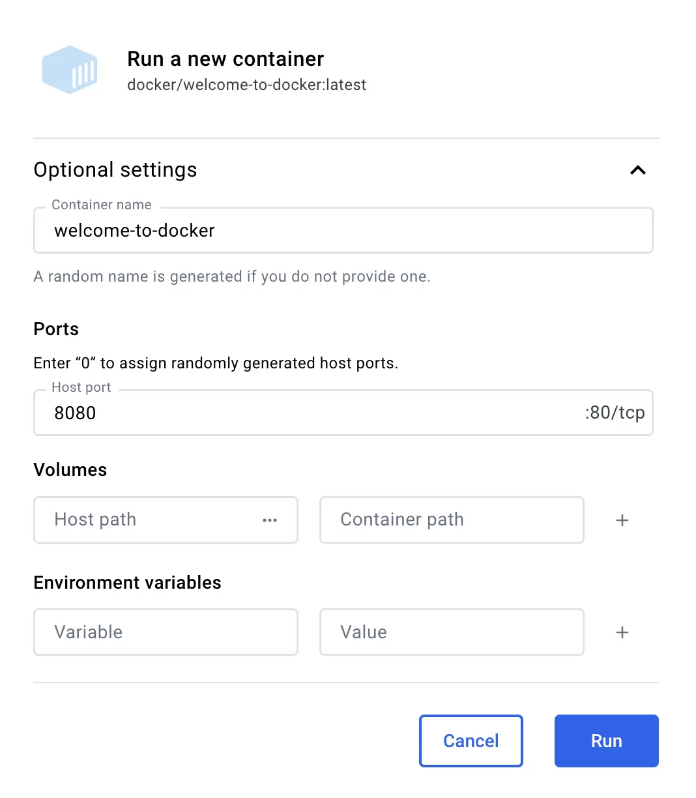
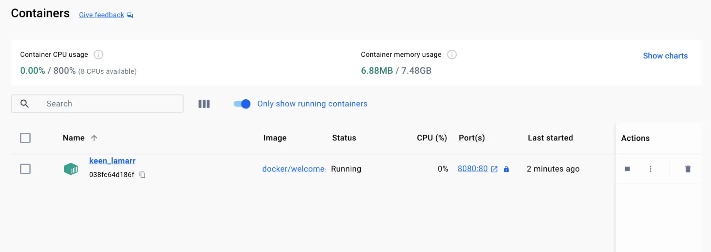
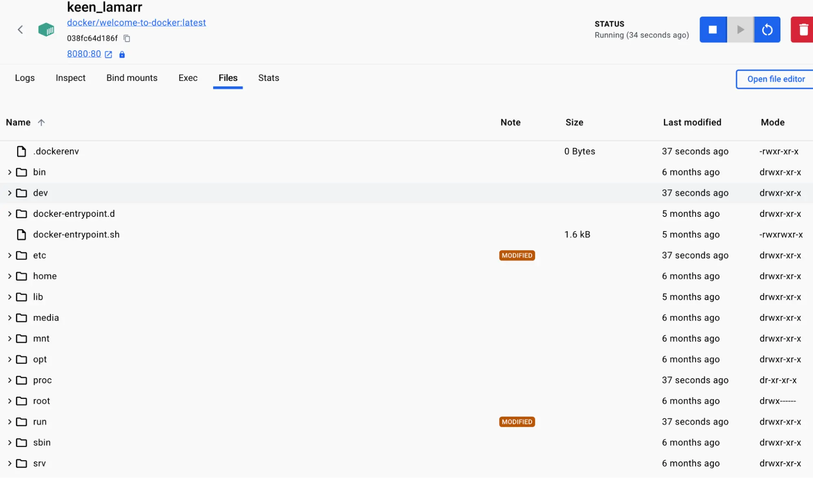
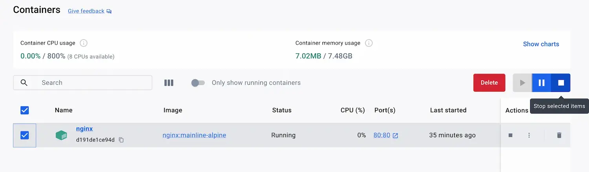

# 容器
## 一、什么是容器？
假设您正在开发一个 Web 应用程序，它有三个主要组件 - React 前端、Python API 和 PostgreSQL 数据库。如果您想参与此项目，则必须安装 Node、Python 和 PostgreSQL。   
您如何确保拥有与团队中其他开发人员相同的版本？或者您的 CI/CD 系统？或者生产中使用的版本？   
如何确保应用程序所需的 Python（或 Node 或数据库）版本不受计算机上已有内容的影响？如何管理潜在冲突？   
什么是容器？简而言之，容器是应用程序每个组件的隔离进程。每个组件（前端 React 应用程序、Python API 引擎和数据库）都在自己的隔离环境中运行，与计算机上的其他所有内容完全隔离。   
以下是它们令人敬畏的原因。容器是：    
- 自包含。每个容器都拥有运行所需的一切，不依赖于主机上任何预安装的依赖项。
- 孤立。 由于容器是独立运行的，因此它们对主机和其他容器的影响最小，从而提高了应用程序的安全性。
- 独立。 每个容器都是独立管理的。删除一个容器不会影响任何其他容器。
- 便携式。 容器可以在任何地方运行！在开发计算机上运行的容器在数据中心或云中的任何位置都将以相同的方式工作！
## 二、容器和虚拟化
无需太深入，VM 是一个完整的作系统，具有自己的内核、硬件驱动程序、程序和应用程序。仅为了隔离单个应用程序而启动 VM 会带来很大的开销。   
容器只是一个隔离的进程，其中包含运行所需的所有文件。如果您运行多个容器，它们都共享同一个内核，从而允许您在更少的基础设施上运行更多的应用程序。   
:::tip
结合使用 VM 和容器   
很多时候，您会看到容器和 VM 一起使用。例如，在云环境中，预置的计算机通常是 VM。但是，具有容器运行时的 VM 可以运行多个容器化应用程序，而不是预置一台计算机来运行一个应用程序，从而提高资源利用率并降低成本。
:::
## 三、试用
在本动手实践中，您将了解如何使用 Docker Desktop GUI 运行 Docker 容器。
### GUI
:::details
使用以下说明运行容器。   
1. 打开 Docker Desktop，然后选择顶部导航栏上的 Search 字段。
2. 在搜索输入中指定 welcome-to-docker，然后选择 Pull 按钮。
3. 成功拉取映像后，选择 Run 按钮。
4. 展开 Optional settings （可选设置）。
5. 在 Container name （容器名称） 中，指定 welcome-to-docker。
6. 在 Host port （主机端口） 中，指定 8080。
7. 选择 Run （运行） 以启动容器。

祝贺！ 您刚刚运行了您的第一个容器！ 🎉

<h5>查看您的容器</h5>

您可以通过转到 Docker Desktop Dashboard 的 Containers （容器） 视图来查看所有容器。

此容器运行一个 Web 服务器，该服务器显示一个简单的网站。在处理更复杂的项目时，您将在不同的容器中运行不同的部分。例如，您可以为前端、后端和数据库运行不同的容器。

<h5>访问前端</h5>

当您启动容器时，您将容器的一个端口暴露到您的计算机上。将此视为创建配置，以便您通过容器的隔离环境进行连接。   
对于此容器，前端可通过端口 8080 访问。要打开该网站，请选择容器的 Port（s） 列中的链接，或在浏览器中访问 http://localhost:8080。

<h5>探索您的容器</h5>

Docker Desktop 允许您探索容器的不同方面并与之交互。亲自尝试一下。   
1. 转到 Docker Desktop Dashboard 中的 Containers 视图。
2. 选择您的容器。
3. 选择 Files （文件） 选项卡以浏览容器的独立文件系统。


<h5>停止容器</h5>

docker/welcome-to-docker 容器将继续运行，直到您将其停止。
1. 转到 Docker Desktop Dashboard 中的 Containers 视图。
2. 找到要停止的容器。
3. 在 Actions 列中选择 Stop作。

:::
### CLI
:::details
按照说明使用 CLI 运行容器：   
打开 CLI 终端，并使用 docker run 命令：
```cmd
docker run -d -p 8080:80 docker/welcome-to-docker
```
此命令的输出是完整的容器 ID。    
祝贺！ 您刚刚启动了您的第一个容器！ 🎉   

<h5>查看正在运行的容器</h5>

您可以使用 docker ps 命令：
```cmd
docker ps
```
您将看到如下所示的输出：
```cmd
 CONTAINER ID   IMAGE                      COMMAND                  CREATED          STATUS          PORTS                      NAMES
 a1f7a4bb3a27   docker/welcome-to-docker   "/docker-entrypoint.…"   11 seconds ago   Up 11 seconds   0.0.0.0:8080->80/tcp       gracious_keldysh
```
此容器运行一个显示简单网站的 Web 服务器。在处理更复杂的项目时，您将在不同的容器中运行不同的部分。例如，前端、后端和数据库的不同容器。

<h5>访问前端</h5>

当您启动容器时，您将容器的一个端口暴露到您的计算机上。将此视为创建配置，以便您通过容器的隔离环境进行连接。   
对于此容器，前端可通过端口 8080 访问。要打开该网站，请选择集装箱的 Port（s） 列中的链接，或访问 http://localhost:8080 浏览器中。

<h5>停止容器</h5>

docker/welcome-to-docker 容器将继续运行，直到您将其停止。您可以使用 docker stop 命令停止容器。   
1. 运行 docker ps 以获取容器的 ID
2. 将容器 ID 或名称提供给 docker stop 命令：
```cmd
docker stop <the-container-id>
```
:::

:::tip
docker ps 命令将仅显示正在运行的容器。要查看已停止的容器，请添加 -a 标志以列出所有容器：docker ps -a
:::
:::tip
按 ID 引用容器时，您无需提供完整的 ID。您只需提供足够的 ID 即可使其唯一。例如，可以通过运行以下命令来停止以前的容器：
```cmd
docker stop a1f
```
:::