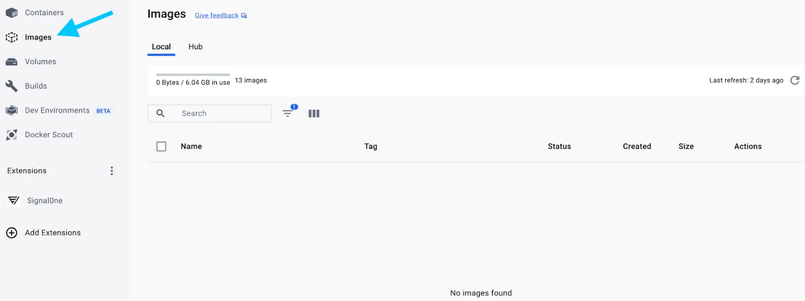
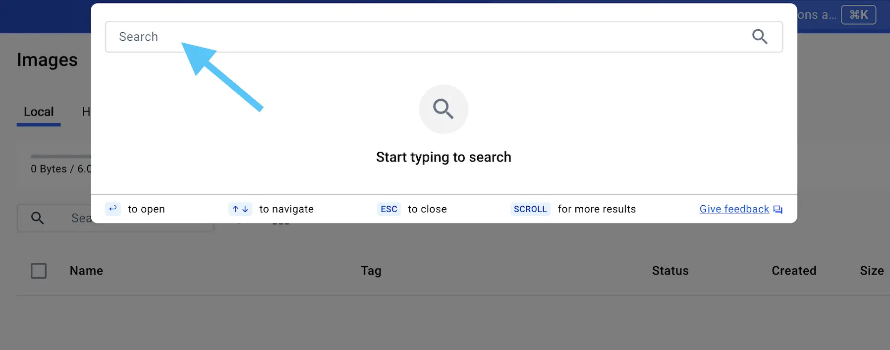

# 镜像
## 一、什么是镜像？
看到容器是一个隔离的过程，它从哪里获取文件和配置？您如何共享这些环境？   
这就是容器映像的用武之地。容器映像是一个标准化软件包，其中包括运行容器所需的所有文件、二进制文件、库和配置。   
对于 PostgreSQL 映像，该映像将打包数据库二进制文件、配置文件和其他依赖项。对于 Python Web 应用程序，它将包括 Python 运行时、您的应用程序代码及其所有依赖项。   
镜像有两个重要的原则：
1. 镜像是不可变的。镜像创建后，无法对其进行修改。您只能制作新镜像或在其上添加更改。
2. 容器映像由层组成。每个层表示一组用于添加、删除或修改文件的文件系统更改。
这两个原则允许您扩展或添加现有镜像。例如，如果您正在构建 Python 应用程序，则可以从 Python 镜像开始，然后添加其他层来安装应用程序的依赖项并添加代码。这使您可以专注于您的应用程序，而不是 Python 本身。
## 二、查找镜像
Docker Hub 是存储和分发映像的默认全球市场。它拥有超过 100,000 个由开发人员创建的映像，您可以在本地运行这些映像。您可以搜索 Docker Hub 映像并直接从 Docker Desktop 运行它们。   
Docker Hub 提供了各种 Docker 支持和认可的映像，称为 Docker 可信内容。这些服务为您自己的映像提供完全托管的服务或出色的启动器。这些包括：
- Docker 官方镜像 - 一组精选的 Docker 存储库，作为大多数用户的起点，是 Docker Hub 上最安全的镜像之一
- Docker 验证发布者 - 来自经过 Docker 验证的商业发布者的高质量镜像
- Docker 赞助的开源 - 由 Docker 通过 Docker 的开源计划赞助的开源项目发布和维护的映像
例如，Redis 和 Memcached 是一些流行的即用型 Docker 官方镜像。您可以下载这些映像，并在几秒钟内启动并运行这些服务。还有一些基础映像，如 Node.js Docker 映像，您可以将其用作起点并添加自己的文件和配置。
## 三、试用
### GUI
:::details
在本动手实践中，您将学习如何使用 Docker Desktop GUI 搜索和拉取容器映像。

<h5>搜索并下载镜像</h5>

1. 打开 Docker Desktop Dashboard，然后在左侧导航菜单中选择 Images 视图。

2. 选择 Search images to run 按钮。如果您没有看到它，请选择屏幕顶部的全局搜索栏。

:::
