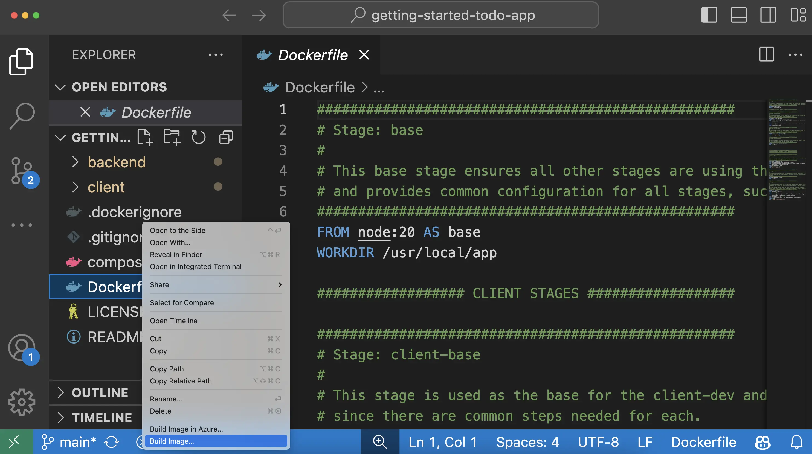

# 开始
## 一、获取Docker Desktop
Docker Desktop 是用于构建镜像、运行容器等的一体化软件包。本指南将引导您完成安装过程，使您能够亲身体验 Docker Desktop。
[下载地址](https://docs.docker.com/get-started/introduction/get-docker-desktop/)
## 二、运行您的首个容器
打开 CLI 终端，然后运行 docker run 命令启动容器：
```cmd
docker run -d -p 8080:80 docker/welcome-to-docker
```
### 1.访问前端
对于此容器，前端可通过端口 8080 访问。要打开该网站，请访问浏览器中的 http://localhost:8080。

### 2.使用 Docker Desktop 管理容器
1. 打开 Docker Desktop 并选择左侧边栏上的 Containers 字段。
2. 您可以查看有关容器的信息，包括日志和文件，甚至可以通过选择 Exec （执行） 选项卡来访问 shell。

3. 选择 Inspect 字段以获取有关容器的详细信息。您可以执行各种操作，例如暂停、恢复、启动或停止容器，或者浏览 Logs （日志）、Bind mounts（绑定挂载）、Exec（执行）、Files （文件） 和 Stats （统计信息） 选项卡。

Docker Desktop 通过简化应用程序在不同环境中的设置、配置和兼容性，简化了开发人员的容器管理，从而解决了环境不一致和部署挑战的痛点。
## 三、使用容器进行开发
现在您已经安装了 Docker Desktop，您可以进行一些应用程序开发。具体来说，您将执行以下作：
1. 克隆并启动开发项目
2. 更改后端和前端
3. 立即查看更改
### 1.启动项目
1. 要开始使用，请将项目作为 ZIP 文件克隆或下载到本地计算机。
2. 克隆项目后，导航到克隆创建的新目录
3. 拥有项目后，使用 Docker Compose 启动开发环境。
4. 要使用 CLI 启动项目，请运行以下命令：
```cmd
docker compose watch
```
您将看到一个输出，其中显示容器镜像被拉取、容器启动等。如果您此时不完全理解，请不要担心。但是，在一两分钟内，事情应该会稳定下来并结束。
5. 打开浏览器以 http://localhost 以查看应用程序已启动并正在运行。应用程序可能需要几分钟才能运行。
### 2.环境中有什么
现在环境已经启动并运行，其中实际上包含什么？概括地说，有几个容器（或进程）每个容器都满足应用程序的特定需求：
- React 前端 - 一个使用 Vite 运行 React 开发服务器的 Node 容器。
- Node 后端 - 后端提供了一个 API。
- MySQL 数据库。
- phpMyAdmin - 一个基于 Web 的界面，用于与可通过 http://db.localhost 访问的数据库进行交互。
- Traefik 代理 - Traefik 是一种应用程序代理，可将请求路由到正确的服务。它将 localhost/api/* 的所有请求发送到后端，将 localhost/* 的请求发送到前端，然后将 db.localhost 的请求发送到 phpMyAdmin。这提供了使用端口 80（而不是每个服务的不同端口）访问所有应用程序的能力。
在此环境中，您作为开发人员无需安装或配置任何服务、填充数据库架构、配置数据库凭证或执行任何作。您只需要 Docker Desktop。其余的都可以使用。
## 四、构建并推送您的第一个镜像
现在，您已经更新了应用程序，您可以为应用程序创建容器镜像并在 Docker Hub 上共享它。为此，您需要执行以下作：
1. 使用您的 Docker 帐户登录
2. 在 Docker Hub 上创建镜像仓库
3. 构建容器镜像
4. 将镜像推送到 Docker Hub
在深入研究实践指南之前，以下是您应该了解的一些核心概念。
### 1.容器镜像
如果您不熟悉容器镜像，请将它们视为一个标准化包，其中包含运行应用程序所需的一切，包括其文件、配置和依赖项。然后，可以分发这些包并与他人共享。
### 2.Docker Hub 
要共享您的 Docker 镜像，您需要一个存储它们的地方。这就是注册表的用武之地。虽然有许多注册表，但 Docker Hub 是镜像的默认和首选注册表。Docker Hub 为您提供了一个存储自己的镜像和查找来自其他人的镜像以运行或用作您自己的镜像基础的地方。   
在 使用容器开发 中，您使用了以下来自 Docker Hub 的镜像，每个镜像都是 Docker 官方镜像：   
- Node - 提供 Node 环境，并用作开发工作的基础。此镜像还用作最终应用程序镜像的基础。
- mysql - 提供 MySQL 数据库来存储待办事项列表项
- phpMyAdmin - 提供 phpMyAdmin，一个基于 Web 的 MySQL 数据库界面
- traefik - 提供 Traefik，这是一种现代 HTTP 反向代理和负载均衡器，可根据路由规则将请求路由到适当的容器
探索 Docker 官方镜像、Docker 验证发布者和 Docker 赞助的开源软件镜像的完整目录，以了解更多可运行和构建的内容。
### 3.创建镜像仓库
现在您拥有账户，可以创建镜像存储库。就像 Git 存储库包含源代码一样，镜像存储库存储容器镜像。
1. 转到 Docker Hub。
2. 选择 Create repository（创建存储库）。
3. 在 Create repository （创建存储库） 页面上，输入以下信息：
存储库名称 - getting-started-todo-app   
简短描述 - 如果您愿意，请随时输入描述   
可见性 - 选择 Public 以允许其他人提取您的自定义待办事项应用程序
4. 选择 Create （创建） 以创建存储库。
### 4.构建并推送镜像
现在您拥有存储库，您可以构建和推送您的镜像。一个重要的注意事项是，您正在构建的镜像扩展了 Node 镜像，这意味着您不需要安装或配置 Node、yarn 等。您可以只专注于使您的应用程序独一无二的原因。
::: tip
<h3> 什么是镜像/Dockerfile？</h3>

在不深入的情况下，将容器镜像视为一个包含运行进程所需的一切的包。在这种情况下，它将包含 Node 环境、后端代码和编译的 React 代码。   

然后，任何使用该映像运行容器的计算机都将能够运行构建的应用程序，而无需在计算机上预安装任何其他内容。   

Dockerfile 是一个基于文本的脚本，它提供有关如何构建映像的指令集。对于此快速入门，存储库已包含 Dockerfile。
:::
#### CLI
::: details
<h5>1.要开始使用，请将项目作为 ZIP 文件克隆或下载到本地计算机。</h5>

```js
git clone https://github.com/docker/getting-started-todo-app
```
克隆项目后，导航到克隆创建的新目录：

```js
cd getting-started-todo-app
```
<h5>2.通过运行以下命令构建项目，将 DOCKER_USERNAME 换成您的用户名。</h5>

```js
docker build -t $DOCKER_USERNAME/getting-started-todo-app.
```
<h5>3.要验证镜像在本地是否存在，您可以使用 docker image ls 命令：</h5>

```js
docker image ls
```
您将看到类似于以下内容的输出：
```js
REPOSITORY                          TAG       IMAGE ID       CREATED          SIZE
mobydock/getting-started-todo-app   latest    1543656c9290   2 minutes ago    1.12GB
...
```
<h5>4.要推送镜像，请使用 docker push 命令。请务必将 DOCKER_USERNAME 替换为您的用户名：</h5>

```js
docker push <DOCKER_USERNAME>/getting-started-todo-app
```
根据您的上传速度，这可能需要一些时间才能完成。
:::
#### VS Code
::: details
<h5>1.打开 Visual Studio Code。确保已从 Extension Marketplace 安装了适用于 VS Code 的 Docker 扩展。</h5>


<h5>2.在 File （文件） 菜单中，选择 Open Folder （打开文件夹）。选择 Clone Git Repository （克隆 Git 存储库） 并粘贴以下 URL：https://github.com/docker/getting-started-todo-app</h5>


<h5>3.右键单击 Dockerfile，然后选择 Build Image... 菜单项。</h5>



<h5>4.在显示的对话框中，输入名称 DOCKER_USERNAME/getting-started-todo-app ，将 DOCKER_USERNAME 替换为您的 Docker 用户名。</h5>

<h5>5.按 Enter 键后，您将看到一个终端出现在将进行构建的位置。完成后，请随时关闭终端。</h5>

<h5>6.通过在左侧导航菜单中选择 Docker 徽标，打开适用于 VS Code 的 Docker 扩展。</h5>

<h5>7.找到您创建的映像。其名称为 docker.io/DOCKER_USERNAME/getting-started-todo-app 。</h5>

<h5>8.展开图像以查看图像的标记（或不同版本）。您应该会看到一个名为 latest 的标记，这是为图像提供的默认标记。</h5>

<h5>9.右键单击最新项目，然后选择 Push... 选项。</h5>


<h5>10.按 Enter 键确认，然后观察您的映像被推送到 Docker Hub。根据您的上传速度，推送映像可能需要一些时间。上传完成后，请随时关闭终端。</h5>
:::