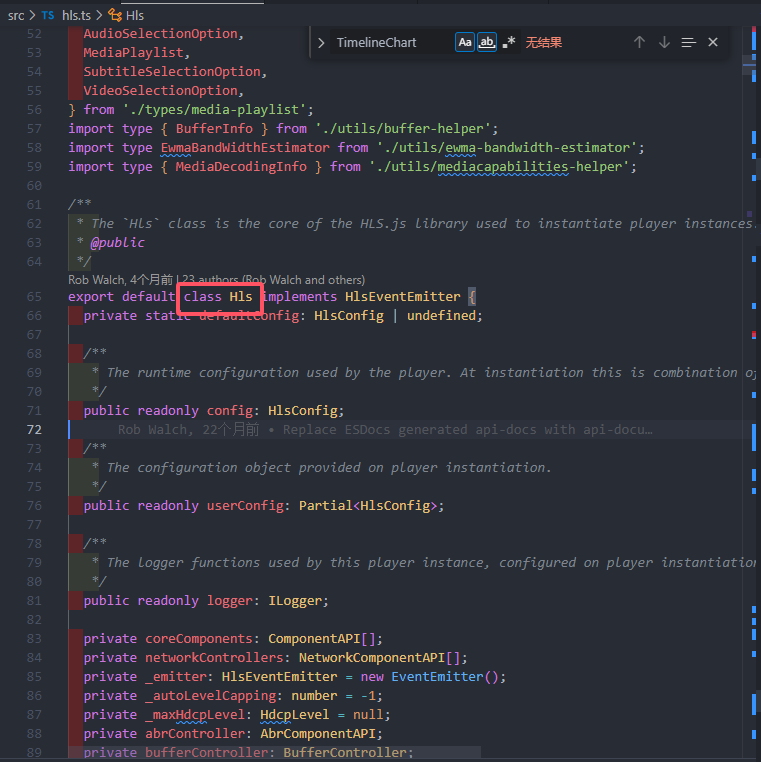

[hls源码地址](https://github.com/video-dev/hls.js.git)
# 解析入口文件
## 一、找到入口文件
通过`package.json`文件找到入口文件：`src\hls.ts`
通过`hls`的使用方式可以知道，他的主体是一个类，于是在入口文件里找到了这个类：

## 二、查看初始化
找到类的`constructor`：
```js
 constructor(userConfig: Partial<HlsConfig> = {}) {

    const logger = (this.logger = enableLogs(
      userConfig.debug || false,
      'Hls instance',
      userConfig.assetPlayerId,
    ));
    const config = (this.config = mergeConfig(
      Hls.DefaultConfig,
      userConfig,
      logger,
    ));
    this.userConfig = userConfig;

    if (config.progressive) {
      enableStreamingMode(config, logger);
    }

    // core controllers and network loaders
    const {
      abrController: _AbrController,
      bufferController: _BufferController,
      capLevelController: _CapLevelController,
      errorController: _ErrorController,
      fpsController: _FpsController,
    } = config;
    const errorController = new _ErrorController(this);
    const abrController = (this.abrController = new _AbrController(this));
    // FragmentTracker must be defined before StreamController because the order of event handling is important
    const fragmentTracker = new FragmentTracker(this);
    const _InterstitialsController = config.interstitialsController;
    const interstitialsController = _InterstitialsController
      ? (this.interstitialsController = new _InterstitialsController(this, Hls))
      : null;
    const bufferController = (this.bufferController = new _BufferController(
      this,
      fragmentTracker,
    ));
    const capLevelController = (this.capLevelController =
      new _CapLevelController(this));

    const fpsController = new _FpsController(this);
    const playListLoader = new PlaylistLoader(this);

    const _ContentSteeringController = config.contentSteeringController;
    // Instantiate ConentSteeringController before LevelController to receive Multivariant Playlist events first
    const contentSteering = _ContentSteeringController
      ? new _ContentSteeringController(this)
      : null;
    const levelController = (this.levelController = new LevelController(
      this,
      contentSteering,
    ));

    const id3TrackController = new ID3TrackController(this);
    const keyLoader = new KeyLoader(this.config);
    const streamController = (this.streamController = new StreamController(
      this,
      fragmentTracker,
      keyLoader,
    ));

    // Cap level controller uses streamController to flush the buffer
    capLevelController.setStreamController(streamController);
    // fpsController uses streamController to switch when frames are being dropped
    fpsController.setStreamController(streamController);

    const networkControllers: NetworkComponentAPI[] = [
      playListLoader,
      levelController,
      streamController,
    ];
    if (interstitialsController) {
      networkControllers.splice(1, 0, interstitialsController);
    }
    if (contentSteering) {
      networkControllers.splice(1, 0, contentSteering);
    }

    this.networkControllers = networkControllers;
    const coreComponents: ComponentAPI[] = [
      abrController,
      bufferController,
      capLevelController,
      fpsController,
      id3TrackController,
      fragmentTracker,
    ];

    this.audioTrackController = this.createController(
      config.audioTrackController,
      networkControllers,
    );
    const AudioStreamControllerClass = config.audioStreamController;
    if (AudioStreamControllerClass) {
      networkControllers.push(
        new AudioStreamControllerClass(this, fragmentTracker, keyLoader),
      );
    }
    // Instantiate subtitleTrackController before SubtitleStreamController to receive level events first
    this.subtitleTrackController = this.createController(
      config.subtitleTrackController,
      networkControllers,
    );
    const SubtitleStreamControllerClass = config.subtitleStreamController;
    if (SubtitleStreamControllerClass) {
      networkControllers.push(
        new SubtitleStreamControllerClass(this, fragmentTracker, keyLoader),
      );
    }
    this.createController(config.timelineController, coreComponents);
    keyLoader.emeController = this.emeController = this.createController(
      config.emeController,
      coreComponents,
    );
    this.cmcdController = this.createController(
      config.cmcdController,
      coreComponents,
    );
    this.latencyController = this.createController(
      LatencyController,
      coreComponents,
    );

    this.coreComponents = coreComponents;

    // Error controller handles errors before and after all other controllers
    // This listener will be invoked after all other controllers error listeners
    networkControllers.push(errorController);
    const onErrorOut = errorController.onErrorOut;
    if (typeof onErrorOut === 'function') {
      this.on(Events.ERROR, onErrorOut, errorController);
    }
  }
```